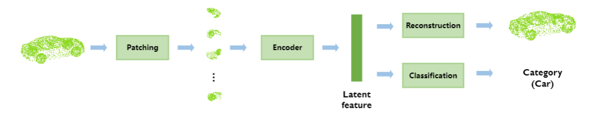

# PMNet



## Overview

This is the depository of PMNet: patch-based multi-task model for point cloud. PMNet supports both point cloud classification and reconstruction tasks.


## Environment

Python 3.8 and Pytorch 1.7

**Other dependencies:**

pytorch3d 0.5.0 for KNN and chamfer loss:	https://github.com/facebookresearch/pytorch3d


## Data Preparation

You need ModelNet40 to reproduce our results. The following steps will show you a general way to prepare point clouds in our experiment.

**ModelNet40**

1. Download the ModelNet40 data: [http://modelnet.cs.princeton.edu](http://modelnet.cs.princeton.edu)

2. Convert CAD models(.off) to point clouds(.ply) by using `sample_modelnet.py`:

   ```
   python ./sample_modelnet.py ./data/ModelNet40 ./data/ModelNet40_pc_1024 --n_point 1024
   ```

## Training

You can download the pretrained model at: []() or use `train.py` to train an autoencoder on ModelNet40 dataset:

```
python ./train.py './data/ModelNet40_pc_1024/**/train/*.ply' './model/trained_128_16' --N 1024 --ALPHA 2 --K 128 --d 16
```

## Testing

```
python ./test.py './data/ModelNet40_pc_1024/**/test/*.ply' './model/trained_128_16''
```


